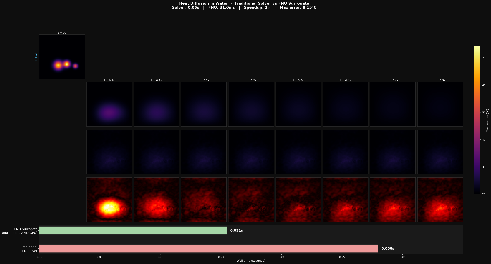
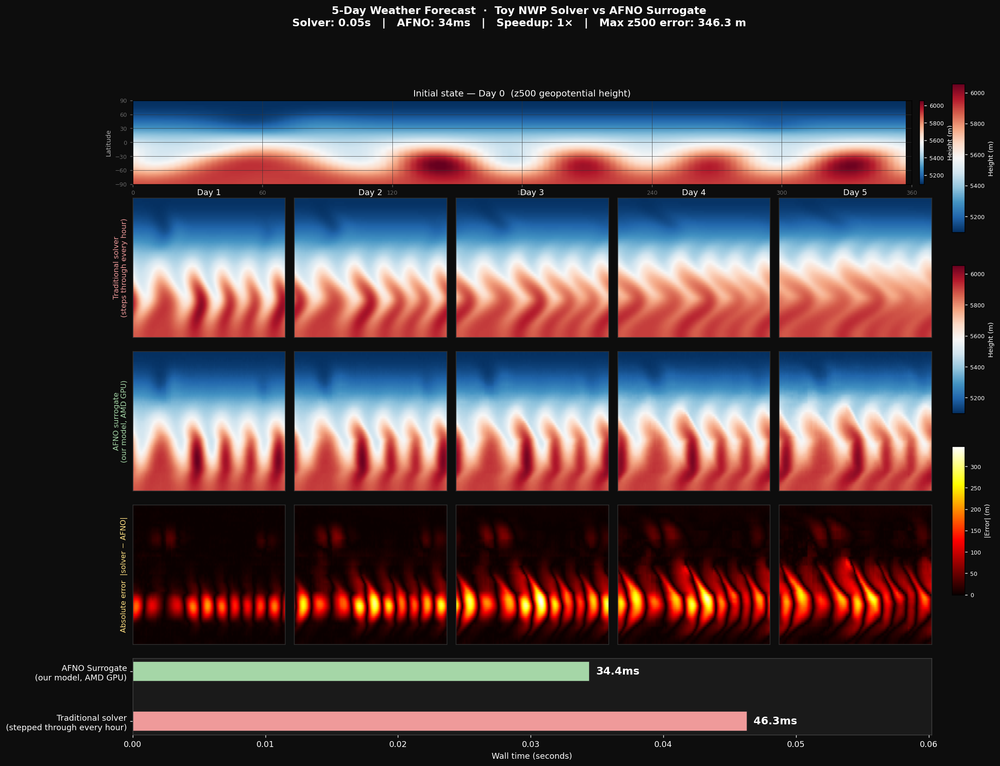

# Solaris

A Physics AI framework for AMD GPUs, based on the architecture of [NVIDIA PhysicsNeMo](https://github.com/NVIDIA/physicsnemo).

Runs on AMD GPUs via PyTorch's ROCm/HIP backend.  The `torch.cuda.*` API is identical whether you run ROCm or CUDA — PyTorch handles the translation transparently.  Distributed collectives go through **RCCL** (AMD's NCCL equivalent), exposed via PyTorch's `"nccl"` backend name.

## TL;DR

Traditional physics simulators are accurate but slow — they grind through thousands of calculation steps every time you change a design. Solaris trains neural networks on solved simulation examples so they can predict new results **instantly**, without re-running the solver from scratch.

On a chip thermal design problem: **5× faster than the simulator across 1000 layouts, 0.05% error, runs on AMD GPUs.**

Five original research contributions on top of the standard approach:
- **Hard physics constraints** — the network mathematically cannot output results that break physics laws
- **Residual correction** — runs a quick coarse simulation first, then uses the network only to fix its mistakes
- **Multi-scale attention** — separate specialist "heads" for large-scale patterns and fine details
- **Calibrated uncertainty** — gives guaranteed confidence intervals, not just a single number
- **Multi-physics coupling** — multiple networks (heat, fluid, structure) that talk to each other

Built for AMD GPUs (RDNA2 through RDNA4, CDNA1 through CDNA3). Drop-in compatible with NVIDIA CUDA via the same `torch.cuda` API.

> **Note:** Demo projects use a **finite-difference solver written from scratch** to generate training data — not commercial simulation software (e.g. ANSYS, COMSOL). The chip thermal dataset is produced by the scipy sparse FD solver with a realistic quad-core floorplan (randomised per-core utilisation, L3 cache, memory controllers, I/O ring), calibrated to a 40–93 °C junction-temperature range. The physics and geometry are representative of real chip designs; the workload patterns are procedurally varied to cover a wide training distribution.

---

## Results

**Chip thermal simulation** — power map → temperature field


> Power map with chip architecture labels → FD solver temperature → FNO prediction → absolute error. 1000 new layouts: FD solver 25s total vs FNO 4.9s total (**5× speedup**), avg rel-L2 **0.05%**.

**Water heat diffusion** — time-evolving temperature field



**Weather forecasting** — multi-day atmospheric prediction



---

## Supported AMD GPU Architectures

| Architecture | GPUs |
|---|---|
| CDNA1 (gfx908) | MI100 |
| CDNA2 (gfx90a) | MI200 series |
| CDNA3 (gfx940/941/942) | MI300 series |
| RDNA2 (gfx1030) | RX 6800/6900 XT |
| RDNA3 (gfx1100) | RX 7900 XTX/XT |
| RDNA4 (gfx1200) | RX 9070/9070 XT |

---

## Quick Start

### 1. Install (CPU or ROCm GPU)

```bash
# CPU-only (for development / testing without GPU)
pip install torch --index-url https://download.pytorch.org/whl/cpu
pip install -e ".[dev]"

# ROCm 6.2 (AMD GPU)
pip install torch --index-url https://download.pytorch.org/whl/rocm6.2
pip install -e ".[dev]"
```

### 2. Verify ROCm

```python
import torch, solaris
print(solaris.get_gpu_backend())   # "rocm" on AMD, "cuda" on NVIDIA, "cpu" otherwise
print(torch.cuda.is_available())       # True on ROCm
print(torch.cuda.get_device_name(0))   # AMD GPU name
```

### 3. Run an Example

```bash
# Synthetic Darcy flow with FNO (CPU)
python examples/train_fno_darcy.py

# Same on AMD GPU
python examples/train_fno_darcy.py --device cuda

# Poisson PINN (CPU)
python examples/train_pinn_poisson.py

# Poisson PINN on AMD GPU
python examples/train_pinn_poisson.py --device cuda
```

### 4. Multi-GPU (RCCL)

```bash
torchrun --nproc_per_node=4 examples/train_fno_darcy.py --device cuda
```

---

## Docker (AMD GPU)

```bash
# Build
docker build -f Dockerfile.rocm -t solaris:latest .

# Run — requires /dev/kfd, /dev/dri access
docker run --rm -it \
    --device=/dev/kfd --device=/dev/dri \
    --group-add video --group-add render \
    solaris:latest bash
```

---

## Models

| Model | Class | Description |
|---|---|---|
| FNO | `solaris.models.FNO` | Fourier Neural Operator (1D/2D/3D) |
| AFNO | `solaris.models.AFNO` | Adaptive Fourier Neural Operator |
| MeshGraphNet | `solaris.models.MeshGraphNet` | Graph network for mesh-based simulations |
| FullyConnected | `solaris.models.FullyConnected` | MLP for PINNs |
| ConstrainedFNO | `solaris.models.ConstrainedFNO` | FNO with hard physics constraint enforcement |
| MultiScaleFNO | `solaris.models.MultiScaleFNO` | Multi-frequency FNO with cross-scale attention |
| NeuralResidualCorrector | `solaris.models.NeuralResidualCorrector` | Hybrid coarse solver + learned error correction |
| ConformalNeuralOperator | `solaris.models.ConformalNeuralOperator` | Any model with guaranteed uncertainty intervals |
| CoupledOperator | `solaris.models.CoupledOperator` | Multi-physics operator composition |

---

## Architecture Overview

```
solaris/
├── core/          # Module base class, ModelMetaData, ModelRegistry
├── models/        # FNO, AFNO, MeshGraphNet, FullyConnected
├── nn/            # Spectral convolutions, activations, embeddings
├── distributed/   # ROCm-aware DistributedManager (RCCL backend)
├── datapipes/     # Dataset, DataLoader, transforms
├── utils/         # Checkpointing, logging
└── metrics/       # relative_l2_error, rmse, nrmse, r2_score
```

---

## ROCm vs CUDA Differences

| Aspect | CUDA (NVIDIA) | ROCm (AMD) |
|---|---|---|
| PyTorch wheels | `--index-url .../whl/cu124` | `--index-url .../whl/rocm6.2` |
| `torch.cuda.*` API | Same | Same (HIP backend) |
| Distributed backend | NCCL | RCCL (via same `"nccl"` name) |
| Dockerfile base | `nvcr.io/nvidia/pytorch:...` | `rocm/pytorch:rocm6.2_...` |
| GPU arch env var | `TORCH_CUDA_ARCH_LIST` | `PYTORCH_ROCM_ARCH` |

---

## Running Tests

```bash
pytest tests/ -v
```

---

## License

Apache 2.0
