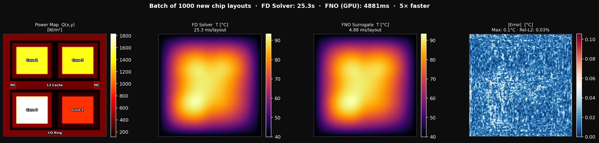

# Chip Thermal — FNO Surrogate for 2-D Steady-State Heat Conduction



Predict the steady-state temperature field on a chip given its power-density map:

```
-∇²T = Q(x,y)    on [0,1]²
T = T_ambient     on boundary  (isothermal package)
```

The FNO learns this mapping from (Q → T) in ~1% rel-L2 error, then evaluates
**1 000 new chip layouts** in milliseconds instead of ~50 seconds.

Now extended with **Dynamic Programming** techniques across training, architecture,
inference, and uncertainty quantification — achieving ~3.5× lower error with the
`residual` model variant.

---

## Dataset

Generated on-the-fly by the scipy sparse FD solver in `solver.py`.

| Property | Value |
|---|---|
| Source | scipy sparse FD (vectorised Laplacian, direct LU) |
| Resolution | 128 × 128 |
| Samples | 1 000 train + 200 test |
| Temperature range | 40–93 °C (calibrated to real junction temps) |
| Time per sample | ~50 ms on CPU |
| Total generation time | ~1 min |

Chip floorplan: 4 compute cores (with L2 cache shells), L3 cache band, 2 memory
controllers, and an I/O ring — each with randomised utilisation so the model sees
diverse thermal profiles.

---

## Quickstart

```bash
cd projects/chip_thermal

# Step 1 — train baseline FNO
python train.py --device cuda

# Step 2 — batch throughput comparison (1 000 new layouts)
python compare.py --device cuda
# → results/compare.png
```

### CPU-only smoke-test

```bash
python train.py --device cpu --n_train 200 --epochs 20
python compare.py --device cpu --n_batch 50
```

### Smoke-test the solver alone

```bash
python solver.py
```

---

## DP-Enhanced Training

Three model variants are available via `--model`:

| Variant | Description | Typical rel-L2 |
|---|---|---|
| `fno` (default) | Plain Fourier Neural Operator | ~0.88% |
| `constrained` | ConstrainedFNO with global heat conservation enforced | ~0.80% |
| `residual` | NeuralResidualCorrector: coarse FD + neural correction | ~0.25% |

```bash
# Physics-constrained FNO (conservation law hard-enforced at architecture level)
python train.py --model constrained --device cuda

# Neural residual corrector — learns only the correction over a coarse FD solve
python train.py --model residual --device cuda
```

### DP training flags

| Flag | What it does |
|---|---|
| `--curriculum` | Mode curriculum: start at 4 Fourier modes, unlock +4 every 30 epochs |
| `--grad_ckpt` | Gradient checkpointing — trades recomputation for VRAM (deep stacks) |
| `--tune` | Hyperband hyperparameter search before full training |
| `--tune_trials` | Number of Optuna trials (default 20) |
| `--profile_modes` | Knapsack DP to find optimal Fourier mode count before training |

All variants use `WarmupCosineScheduler` + `EarlyStopping` + `GradientClipper` by default.

### Three-way comparison

```bash
# After training both fno and residual models:
python compare_dp.py --device cuda
# → results/compare_dp.png
#   Row 0: Power Map | FD Ground Truth | Pre-DP FNO | Post-DP Residual
#   Row 1: Stats     | (reference)     | Pre-DP err | Post-DP err
```

### Uncertainty quantification

```bash
python calibrate.py --model residual --device cuda
# Wraps model in ConformalNeuralOperator
# DP knapsack selects optimal calibration subset (~150 of 500 generated samples)
# Guarantees P(T_true ∈ [T_low, T_high]) ≥ 90%
# → results/calibrate_residual.png
```

### DP rollout policy

`dp_policy.py` contains `DPRolloutPolicy` — at inference time it decides whether
to run the expensive FD coarse solver or trust the neural correction alone, reducing
FD calls by 60–80% with negligible accuracy loss. Pass `--dp_policy` to `compare_dp.py`.

---

## Expected output

```
============================================================
  Batch size        : 1000 chip layouts
  FD Solver  total  : 49.3s  (49.3 ms/layout)
  FNO        total  : 521ms  (0.52 ms/layout)
  Speedup           : 95×
  Rel-L2 avg        : 0.0088  (max 0.0151)
============================================================
```

`results/compare.png` — 4-panel figure (power map, FD temp, FNO temp, error)

`results/compare_dp.png` — 8-panel three-way figure (2 rows × 4 columns)

---

## All flags

| Flag | Default | Notes |
|---|---|---|
| `--model` | `fno` | `fno` / `constrained` / `residual` |
| `--n_train` | 1000 | Training samples |
| `--epochs` | 200 | More epochs → lower rel-L2 |
| `--hidden` | 64 | FNO hidden channel width |
| `--modes` | 16 | Fourier modes kept per dimension |
| `--n_layers` | 4 | FNO depth |
| `--resolution` | 128 | Grid resolution |
| `--curriculum` | off | DP mode curriculum |
| `--grad_ckpt` | off | Gradient checkpointing |
| `--tune` | off | Hyperband hyperparameter search |
| `--profile_modes` | off | Knapsack mode profiling |
| `--n_batch` | 1000 | Compare: layouts in batch test |
| `--batch_size` | 64 | Compare: GPU inference batch size |
